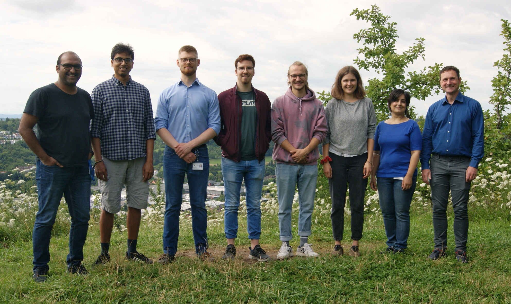

Clinical bioinformatics & machine learning in translational single-cell biology 
======
Phenotype of multicellular organisms is the result of an intricate interplay of heterogeneous cell populations. Many complex diseases feature a disruption of this interplay or are the result of a pathologically altered cell population. Our lab develops formalisms to summarize molecular and functional properties of such heterogeneous cell populations on the basis of single cell resolved data sources and thereby aims to contribute to a systems-level understanding of complex biological systems, their pathological alterations and a perspective to rationally specify novel therapeutic targets.

Multicellular organisms are typically composed of a plethora of different cell types. These cell types are organized in organs, tissues or more amorphous assemblies that carry out specific concerted functions. Therefore, each cell resorts to complex protein machinery that, within a multicellular organism, may vary substantially across individual cells due to differences in cellular memory, cell cycle stage, age, environment or differentiation stage. Although being of great importance to fundamental and clinical research, knowledge about the heterogeneity, dynamics and interplay of the different cell types at molecular detail is still sparse due to the experimental difficulty to monitor a sufficiently large number of informative molecular players at single cell or at least at cell type resolution. The recent introduction of novel deep single cell resolved measurement techniques for proteins and transcripts has opened avenues to fill the many gaps of the molecular and functional characterization of heterogeneous cell populations.

It is an open question how to extract the relevant biological information from these novel data sources and to comprehensively, yet concisely and intelligibly describe the dynamics and function of heterogeneous cell populations at molecular detail. Our lab develops  machine learningmethods to accomplish this goal. Specifically, we develop appropriate formalisms to represent and learn the  temporal dynamics of cell states, develop methods to define  functionally relevant cell types and devise formal approaches to reason about the communication at the cell type level, i.e. to systematically discover  cell-cell communication networks. Our inference approaches typically build on experiments with a  single cell readout of protein or transcript abundances. We are also establishing computational  data integration methods to leverage information across different measurement platforms, such as flow cytometry, mass cytometry, live cell imaging or quantitative genome wide omics technologies. We are further interested in analyzing the resulting descriptive models from a reverse engineering perspective to elucidate which type of  signal processing paradigms are implemented by biological systems at the intra- as well as intercellular scale. All the described methods and concepts are predominantly applied in the context of ongoing collaborations with experimentalists in the fields of immunology and cancer biology.
