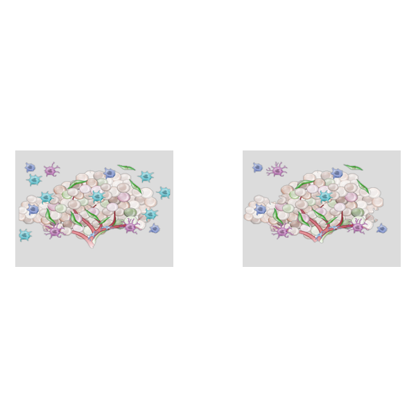
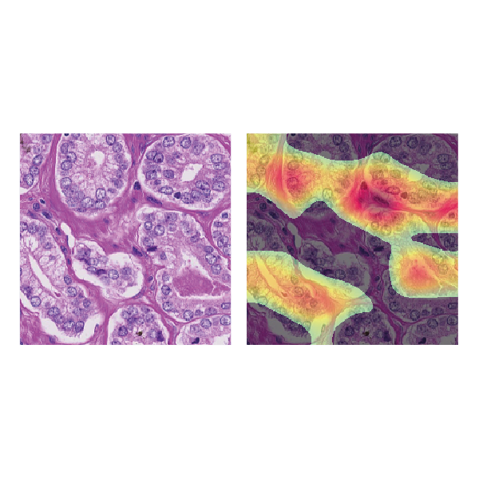
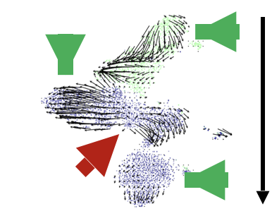

The research of our lab can be divided into five core aspects:

- [Comparative single-cell data analysis](../research/single-cell-analysis.md)
- [Comparative single-cell timeseries analysis](../research/single-cell-timeseries-analysis.md)
- [Comparative spatial single-cell analysis](../research/spatial-single-cell-analysis.md)
- [T cell exhaustion dynamics](../research/t-cell-exhaustion-dynamics.md)
- [Unsupervised cell type definition and dynamics](../research/unsupervised-annotation-dynamics.md)

-  [Comparative single-cell data analysis](../research/single-cell-analysis.md) 

-  [Comparative single-cell timeseries analysis](../research/single-cell-timeseries-analysis.md)

-  [Comparative spatial single-cell analysis](../research/spatial-single-cell-analysis.md) 
